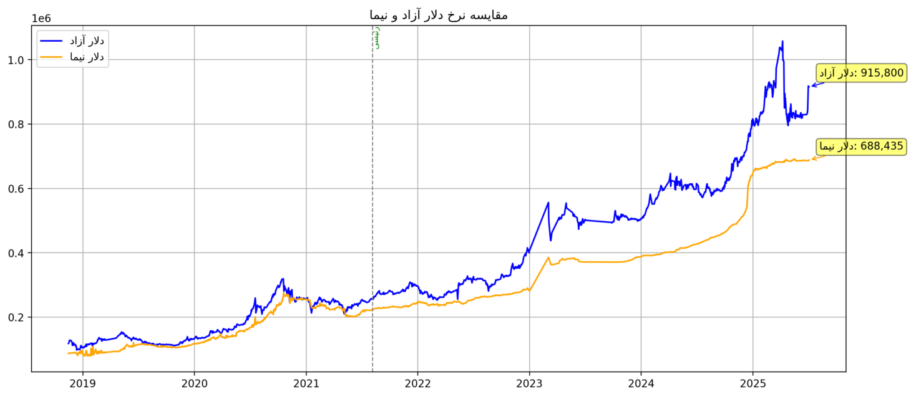

# exchange_rates_USD
در این پروژه، اطلاعات مربوط به نرخ‌های ارز از وب‌سایت tgju.org استخراج شده و روند تغییرات آن‌ها در دوره‌های مختلف ریاست‌جمهوری ایران به‌صورت گرافیکی نمایش داده شده است.

هدف از این تحلیل، فراهم آوردن دیدی شفاف و قابل درک برای پژوهشگران، اقتصاددانان و علاقه‌مندان به حوزه اقتصاد است تا بتوانند تأثیر سیاست‌های کلان بر نرخ ارز را بهتر بررسی کنند.
# اجرای کد
با کلیک روی این لینک زیر علاوه بر مقایسه نمودارهای دلار بازر آزاد و دلار نیمایی، فایل استخراجی آن نیز قابل دانلود خواهد بود.

https://exchangeratesusd-8rilbsch3nm6azbxeeqzn8.streamlit.app/

In this project, I extracted currency exchange rate data from tgju.org and visualized the trends across different presidential terms in Iran.
The goal is to provide a clear and insightful view for researchers, economists, and those interested in economic trends to better understand the impact of macroeconomic policies on currency rates.

# run the propgram below

By clicking the link below, you can not only compare the charts of the free-market USD and the Nima USD rates, but also download the extracted data file.

https://exchangeratesusd-8rilbsch3nm6azbxeeqzn8.streamlit.app/

